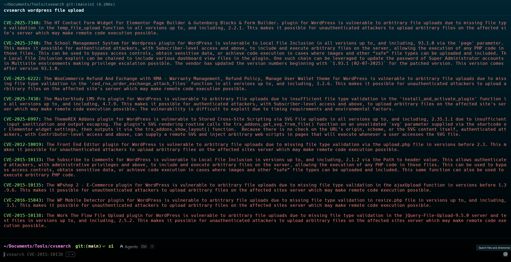
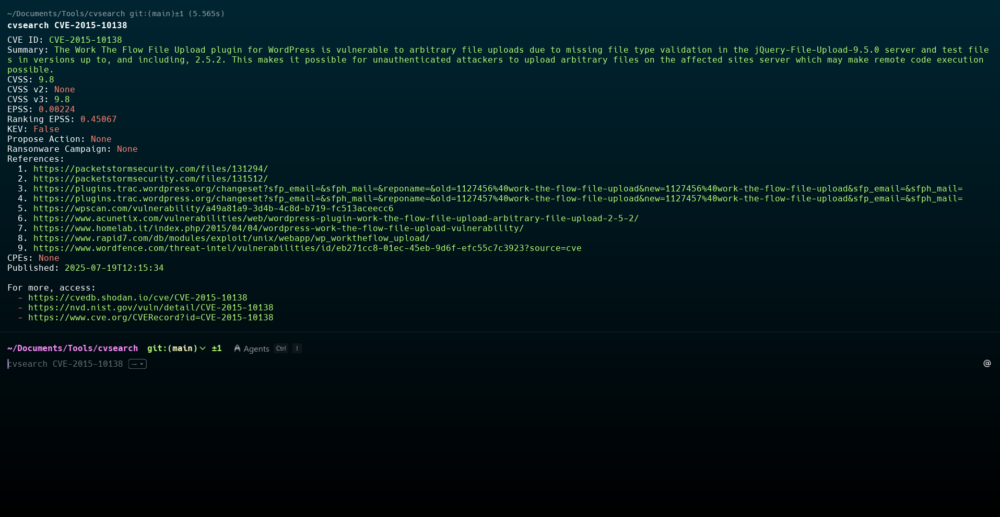

# CVE Search Script

A simple Python script to search for CVEs (Common Vulnerabilities and Exposures) on the NVD (National Vulnerability Database) via their REST API.  
It allows you to search using keywords passed as command-line arguments and displays the CVE ID and description with color formatting.

---

## Requirements

- Python 3.x
- [requests](https://pypi.org/project/requests/)
- [colorama](https://pypi.org/project/colorama/)
- re

You can auto-install with

```bash
git clone https://github.com/damclover/cvsearch
cd cvsearch
sudo chmod +x install.sh
./install.sh
````

---

## Usage

Run the script with keywords as arguments:

```bash
cvsearch wordpress file upload
```

The script will search CVEs related to the keywords (e.g. "wordpress file upload") and print the CVE ID in green and the description in red.

---

## Example Output



# New update!!
#### Now the script uses the Shodan API to detail CVEs (Shodan's free API)

## Usage

```bash
cvsearch CVE-2015-10138
```

## Output

---

## How it works

* The script takes all command-line arguments and concatenates them into a single search string.
* It sends a request to the NVD REST API to search for CVEs containing the keywords.
* Results are parsed and displayed with colored output for better readability.
* With the Shodan update, you can now get more information about a given CVE.

# Full Usage


https://github.com/user-attachments/assets/c5ae37c2-a14d-40b0-b0c8-312a12dd941b


---

## Notes

* The NVD API may have rate limits or require an API key for heavy usage.
* The script currently does not handle pagination; it only shows results from the first API response.

---

## Author

Created by DamClover
